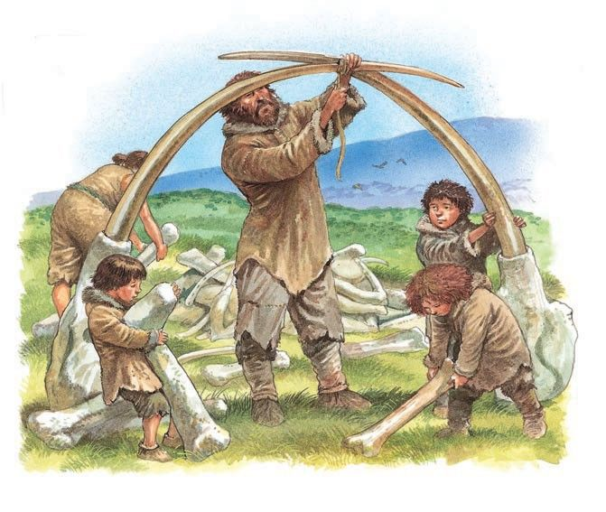

# THE END OF THE STONE AGE

The struggle to keep alive during the cold period was terrible.
Many races of men and animals, whose bones we have found,
disappeared from the face of the earth.
Whole tribes and clans were wiped out by hunger and cold and
want. First the children would die and then the parents. The old
people were left to the mercy of the wild animals who hastened
to occupy the undefended cave. Until another change in the
climate or the slowly decreasing moisture of the air made life
impossible for these wild invaders and forced them to find a
retreat in the heart of the African jungle where they have lived
ever since.
This part of my history is very difficult because the changes
which I must describe were so very slow and so very gradual.
Nature is never in a hurry. She has all eternity in which to
accomplish her task and she can afford to bring about the
necessary changes with deliberate care.
Prehistoric man lived through at least four definite eras when
the ice descended far down into the valleys and covered the
greater part of the European continent.
The last one of these periods came to an end almost thirty
thousand years ago.
From that moment on man left behind him concrete evidence of
his existence in the form of tools and arms and pictures and in
a general way we can say that history begins when the last cold
period had become a thing of the past.
The endless struggle for life had taught the survivors many
things.
Stone and wooden implements had become as common as steel
tools are in our own days. Gradually the rudely chipped flint axe had been replaced by one
of polished flint which was infinitely more practical. It allowed
man to attack many animals at whose mercy he had been since
the beginning of time.
The mammoth was no longer seen.
The musk-ox had retreated to the polar circle.
The tiger had left Europe for good.
The cave-bear no longer ate little children.
The powerful brain of the weakest and most helpless of all
living creatures--Man--had devised such terrible instruments of
destruction that he was now the master of all the other
animals.
The first great victory over Nature had been gained but many
others were to follow.
Equipped with a full set of tools both for hunting and fishing,
the cave-dweller looked for new living quarters.
The shores of rivers and lakes offered the best opportunity for a
regular livelihood.
The old caves were deserted and the human race moved toward
the water.
Now that man could handle heavy axes, the felling of trees no
longer offered any great difficulties.
For countless ages birds had been constructing comfortable
houses out of chips of wood and grass amidst the branches of
trees.
Man followed their example.
He, too, built himself a nest and called it his "home."
He did not, except in a few parts of Asia, take to the trees
which were a bit too small and unsteady for his purpose.
He cut down a number of logs. These he drove firmly into the
soft bottom of a shallow lake. On top of them he constructed a
wooden platform and upon this platform he erected his first
wooden house.
It offered many advantages over the old cave.
No wild animals could break into it and robbers could not enter
it. The lake itself was an inexhaustible store-room containing an
endless supply of fresh fish.
These houses built on piles were much healthier than the old
caves and they gave the children a chance to grow up into
strong men. The population increased steadily and man began
to occupy vast tracts of wilderness which had been unoccupied
since the beginning of time.
And all the time new inventions were made which made life
more comfortable and less dangerous.
Often enough these innovations were not due to the cleverness
of man's brain.
He simply copied the animals.
You know of course that there are a large number of beasties
who prepare for the long winter by burying nuts and acorns and
other food which is abundant during the summer. Just think of
the squirrels who are for ever filling their larder in gardens and
parks with supplies for the winter and the early spring.
Early man, less intelligent in many respects than the squirrels,
had not known how to preserve anything for the future.
He ate until his hunger was stilled, but what he did not need
right away he allowed to rot. As a result he often went without
his meals during the cold period and many of his children died
from hunger and want.
Until he followed the example of the animals and prepared for
the future by laying in sufficient stores when the harvest had
been good and there was an abundance of wheat and grain.
We do not know which genius first discovered the use of pottery
but he deserves a statue.
Very likely it was a woman who had got tired of the eternal
chores of the kitchen and wanted to make her household duties
a little less exacting. She noticed that chunks of clay, when
exposed to the rays of the sun, got baked into a hard
substance.
If a flat piece of clay could be transformed into a brick, a
slightly curved piece of the same material must produce a
similar result.
And behold, the brick grew into a piece of pottery and the
human race was able to save for the day of tomorrow.
If you think that my praises of this invention are exaggerated,
look at the breakfast table and see what pottery, in one form
and the other, means in your own life.
Your oatmeal is served in a dish.
The cream is served from a pitcher.
Your eggs are carried from the kitchen to the dining-room table
on a plate.
Your milk is brought to you in a china mug. Then go to the
store-room (if there is no store-room in your house go to the
nearest Delicatessen store). You will see how all the things
which we are supposed to eat tomorrow and next week and next
year have been put away in jars and cans and other artificial
containers which Nature did not provide for us but which man
was forced to invent and perfect before he could be assured of
his regular meals all the year around.
Even a gas-tank is nothing but a large pitcher, made of iron
because iron does not break as easily as china and is less
porous than clay. So are barrels and bottles and pots and pans.
They all serve the same purpose--of providing us in the future
with those things of which we happen to have an abundance at
the present moment.
And because he could preserve eatable things for the day of
need, man began to raise vegetables and grain and saved the
surplus for future consumption.
This explains why, during the late Stone Age, we find the first
wheat-fields and the first gardens, grouped around the
settlements of the early pile-dwellers.
It also tells us why man gave up his habit of wandering and
settled down in one fixed spot where he raised his children until
the day of his death when he was decently buried among his
own people.
It is safe to say that these earliest ancestors of ours would
have given up the ways of savages of their own accord if they
had been left to their fate.
But suddenly there was an end to their isolation.
Prehistoric man was discovered.
A traveler from the unknown south-land who had dared to cross
the turbulent sea and the forbidding mountain passes had found
his way to the wild people of Central Europe.
On his back he carried a pack.

